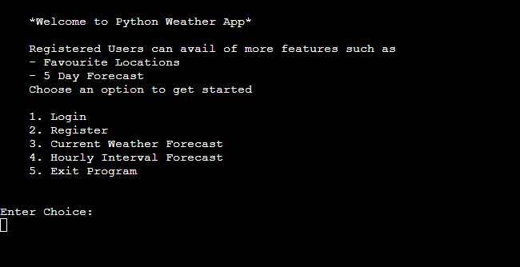
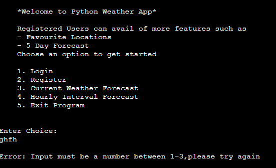

NOTE: APP may not run correctly due to AWS instance being switched off due to unused resources

# PyWeather
Find Hourly and Daily Forecasts in any location with this CLI weather program

The Objective of this project is to provide users with accurate weather data for any location using 
the popular web service API Openweather Map. Users can also create an account and save their 
favourite locations so they can search quicker the next time they use the program. This functionality is achieved
by using AWS as a provider for the database using a hosted RDS instance specifically. The Application is displayed to the user on a command line interface.
Registered and Logged in users can avail of more features such as Add favourite locations, Search weather quickly for these locations, and access to a 5 day forecast for any location.

The Deployed Site is available [HERE](https://python-weatherapp.herokuapp.com/)

## Table of Contents
+ [UX](#ux "UX")
  + [Audience](#audience "Audience")
  + [Current User Goals](#current-user-goals "Current User Goals")
  + [New User Goals](#new-user-goals "New User Goals")
+ [Design](#design "Design")
  + [Interface](#interface "Interface")
+ [Features](#features "Features")
  + [Current Features](#current-features "Current Features")
  + [Future Features](#future-features "Future Features")
+ [Testing](#testing "Testing")
  + [PEP8 Validation](#pep8-validation "PEP8 Validation")
  + [Manual Testing](#manual-testing "Manual Testing")
  + [Unfixed Bugs](#unfixed-bugs "Unfixed Bugs")
+ [Technologies Used](#technologies-used "Technologies Used")
  + [Languages Used](#languages-used "Languages Used")
  + [External Programs and Libraries Used](#external-programs-and-libraries-used "External Programs and Libraries Used")
  + [Python Libraries](#python-libraries "Python Libraries")
  + [AWS - RDS Database](#amazon-web-services-rds-database "Amazon Web Services RDS Database")
  + [SQL Data Model](#sql-data-model "SQL Data Model")
+ [Deployment](#deployment "Deployment")
+ [Credit](#credit "Credit")
  + [Code](#code "Code")
  
  
  
## UX

### Audience:
The Program was designed with no particular audience targeted, rather providing a useful service to all demographics.

### Current User Goals:
- Check Weather Quickly in favourite locations.
- Check 5 day forecast in a location easily.

### New User Goals:
- Create an account to save favourite locations.
- Check weather forecast quickly without logging in.

## Design

#### Interface
  - The Terminal Interface was provided by Code Institute to students to allow the Python program run on a webpage.
  - Throughout the program the user interacts with menus displayed with choices and an input prompt for each action.

## Features 

### Current Features 

#### Game Start Menu

This is the landing page for all users when the program is run. giving them multiples choices of actions to take.

#### Register 

This Feaure allows users to register an account for the program. Giving them access to more features. A new User is created in the AWS Hosted Database through querys in the backend.

#### Login 

This is the login feature that allows registered users to login. The program checks the username and password in the background, if username doesn't exist or password is incorrect, the user is prompted to try again. if Credentials are correct the user home menu is displayed.

#### Current Weather Forecast

This feature displays live weather data from the OpenWeatherMap API that is processed and formatted in the backend. This feature only shows the current weather in a specified location from the user.

#### Hourly Interval Forecast

This feature displays live weather data from the OpenWeatherMap API that is processed and formatted in the backend. This feature shows the weather data in a specified location from the user in 1 hour intervals for the next 12 hours.

#### Five-Day Forecast

This feature displays live weather data from the OpenWeatherMap API that is processed and formatted in the backend. This feature shows the weather data in a specified location from the user for the next 5 days.

#### Add Favourite Location

This Feature allows logged in users to add favourite locations. Weather can be searched for these locations very quickly once added.

#### Search Weather in Favourite Location 

This Feature allows logged in users to view all of their favourite locations and choose quickly by input which location they want to view weather for. They are then prompted to enter if they want a hourly interval or 5 day forecast

#### Change Password

This Feature allows logged in users to change their password to the program. Users must enter their current password correctly first and then their new password twice to confirm they are the same. If succesfull password is changed. If the user makes an error the appropriate message is displayed.

### Future Features

- Use GeoLocation to find user's current position without input.
- Send Weather Alerts to logged in user's email address for specified locations.
- Display the Weather data in a Table.

## Testing

### PEP8 Validation 

As per the project requirements, I put each of my module code through the Python Linter provided by Code Institute. Each module is error free after corrections.

#### Main.PY
  
  
#### Weather.PY
  

#### DB.PY
  
  
#### Config.PY
  

#### Run.PY
  

### Manual Testing

Manual Tests were carried out throughout the application. I tested valid and invalid data for each of the inputs throughout the program. The invalid data was caught and processed in the program and displays appropriate message back the user. This allows the application to flow freely.

#### Invalid Input Data Response

  ##### Incorrect Current Password When Changing Password
  
  
  ##### New Passwords not matching When Changing Password
  
  
  ##### Entering a username that doesn't exist
  
  
  ##### Incorrect Password When Logging in
  
  
  ##### Invalid input on menu
  
  
  ##### Invalid location on weather search
  
  
  ##### Empty input on menu
  

### Unfixed Bugs
##### Module Error
- I split my code into relevant modules to improve maintainability and organisation within the code. It also improves seperation of concerns. I focused more on this than having my modules independent of each other. When I initially split the code into a "modules" folder with my .py scripts inside. I received errors on import with error " no module named SCRIPT_NAME in modules". My solution was to have the modules in the main folder rather than inside modules.

## Technologies Used

### Languages Used
- Python - used to develop the functionality for program
- SQL - used for querying the database within the program.

### External Programs and Libraries Used
- JSONFormatter - used to format the JSON response for distuingishing objects.
- Amazon Web services - used to host the database.
- MYSQL Workbench - for accessing the database and creating the tables.
- GitPod - to creat my python scripts before pushing the project to Github.
- GitHub - to store my repository for submission.

### Python Libraries
- Mysql-connector-python - used to connect and query the database.
- dotenv-python - used to access the environment variables
- requests - used to send HTTP requests to the OpenWeatherMap API service.

### Amazon Web Services RDS Database

- Using prior experience with AWS. I decided to setup a RDS instance to host my database for this project. This uses free tier services and configuration so I wont be charged unless the memory exceeds the free tier maximum memory of 20gb. This instance will be terminated after project is graded. 
- The connection to the database inside the program is achieved using mysql-connector within the db.py module.

#### Summary of weatherapp RDS instance
   
   
### SQL Data Model

  #### Below is the SQL Querys used to create the schemas for my data models used throughout the program. These queries were run using MYSQL Workbench.
  
  #### Location
  
  ` CREATE TABLE Locations (
    LocationID INT NOT NULL AUTO_INCREMENT,
    username VARCHAR(255),
    location VARCHAR(255),
    Lat VARCHAR(255),
    Lon VARCHAR(255),
    PRIMARY KEY (LocationID)
);
`
#### User
`CREATE TABLE user (
    UserID INT NOT NULL AUTO_INCREMENT,
    username VARCHAR(255),
    password VARCHAR(255),
    PRIMARY KEY (UserID)
);
`

## Deployment
The site was deployed to Heroku as follows

- Open Heroku Dashboard and click on "Create New App"
- Enter unique app name and choose Region, Click on "Create App"
- On the App Dashboard, we need to connect to our github repository, Under "Deployment Method" click on "Github" and log in and authorize.
- Search for our repository, In this case - Python-WeatherApp
- Navigate to the settings tab and click on "Reveal Config Vars".
- Enter any private enviroment variables here, In this case - I had my API_KEY and Database Credentials.(USER,HOST,PORT,NAME)
- Next, Click on "Add Buildpack" and add "Python" and "Node.js" making sure python is on top.
- Finally, Navigate back to the Deploy Section and click on "Deploy Branch"

### Cloning for Further Development(GitPod)

 - Open Gitpod
 - On the search bar, put the repository you want to clone https://github.com/scottsmyth56/Python-WeatherApp.git and press Enter 
 - Gitpod will open the workspace, with the repository cloned and ready to use.
 - You can find your cloned repository on the left sidebar,
 - You can start working on the codebase, make changes and save them
 - When you are ready to push your changes, open the terminal and run git add . to add all the changes,
 - Commit your changes by running git commit -m "your commit message",
 - Push your changes by running git push.

### Cloning for Further Development ( Locally )
 - Make sure you have Git installed on your computer. If you don't have it already, you can download it from the official website (https://git-scm.com/)
 - Open a terminal window (on Windows, Git Bash is a good option)
 - Navigate to the directory where you want to clone the repository using the cd command. For example, to navigate to the Documents folder, you would use the command cd Documents.
- Use the following command to clone the repository: git clone https://github.com/scottsmyth56/Python-WeatherApp.git
 - The command will create a new directory called "Python-WeatherApp" in the current directory, and will copy all the files from the repository into that directory.
 - Navigate into the newly cloned directory by running cd Python-WeatherApp.
 - you can check the content of the cloned repository by running ls command
 - Make sure to update your local copy with the remote repository by running git pull command
 - you can start to use the cloned repository as you wish

 The Deployed Site is available [HERE](https://python-weatherapp.herokuapp.com/)

## Credit 

### Code
#### Code/configuration was taken from official documentation of service providers.

- [Configuring AWS Database](https://docs.aws.amazon.com/AmazonRDS/latest/UserGuide/CHAP_GettingStarted.CreatingConnecting.MySQL.html)
- [OpenWeather Map API Syntax](https://openweathermap.org/api)
- [MySQL Connector ](https://dev.mysql.com/doc/connector-python/en/)
- [Date Time Syntax](https://docs.python.org/3/library/datetime.html)

